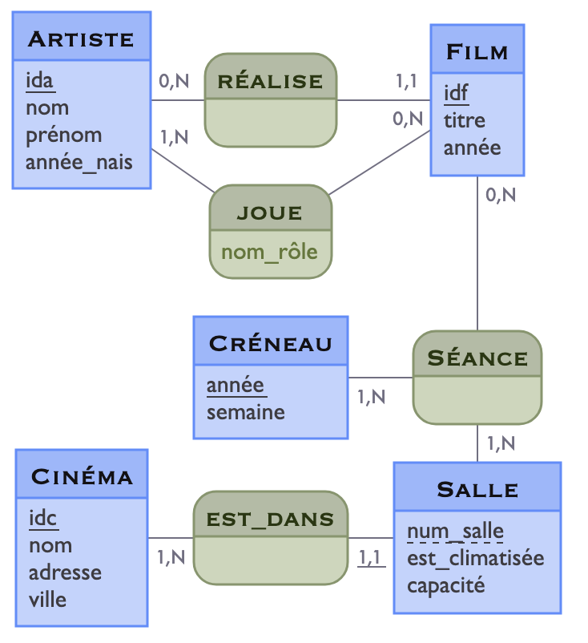

# IRISTR : Bases de Données 
## TP 1 :  Premières requêtes SQL

---

#### Objectifs du TP : 
  - maîtriser la rédaction de requêtes simples et des requêtes avec jointures.  

---

### Lancement de POSTGRESQL dans un container DOCKER

Vous avez deux possibilités pour travailler sur votre base de données. Vous pouvez soit utiliser l'espace de travail sur le Cloud via `Codespace`, soit récupérer le container Docker en local sur votre machine.

#### À distance sur Codespace

 - Aller sur la page [https://github.com/nlumineau/isitr-bd](https://github.com/nlumineau/isitr-bd) 

 - En cliquant sur le bouton vert 'Code', vous avez deux onglets qui apparaissent `Local` et `Codespaces`. Cliquer sur `Codespaces`.
 
 - Cliquer ensuite sur le menu `...`, puis sur `+ New with options...`.

 - Modifier le paramétrage si nécessaire, mais celui par défaut convient, puis cliquer sur le bouton vert `Create codespace`.
   
 - Passer à la section : 'Connexion à laa BD'

#### En local 

Vous diposez du projet `isitr-bd`  sur gitHub : [https://github.com/nlumineau/isitr-bd/](https://github.com/nlumineau/isitr-bd/)

- Récupérer le projet
``` 	
	git clone https://github.com/nlumineau/isitr-bd.git
```

 - Passer à la section : 'Connexion à laa BD'

#### Connexion à la BD

- Lancer l'instance de postgresql
``` 	
	docker compose up
```

- Se connecter à la base
```
	docker exec -it postgres-db psql -U etudiant -d formation
```

- Lister les tables
```
  SET search_path TO cinema;	
  \dt
  SELECT * FROM  artiste LIMIT 10;
```


- Stoper le container et supprimer les volumes
```
	docker compose down -v
``` 


### À propos des données

Le jeu de données de ce TP porte sur données en lien avec le cinéma. 
des artistes et des films. Vous trouverez le **modèle conceptuel** de cette base illustré sur la Figure 1 et le **modèle relationnel** spécifié sur la Figure 2.


<table border="0">
<tr>
<td>
<center>


Figure 1 : Schéma E/A

</center> 
</td>
<td>


- artiste(<u>ida</u>, nom, prenom, annee_nais)<br>
- film(<u>idf</u>, titre, annee, \#id_realisateur)<br>
- joue(<u>\#ida,\#idf</u>, nom_role)<br>
- cinema(<u>idc</u>, nom, adresse, ville)<br>
- salle(<u>\#idc, num_salle</u>, est_climatise, capacite)<br>
- seance(<u>\#idf, \#(idc, num_salle), annee, semaine)</u><br>	


<center>
Figure 2 : Modèle relationnel
</center>


</td>
</tr>
</table>

Les artistes peuvent être des acteurs/actrices ou des réalisateurs/réalisatrices. Un artiste est identifié de manière unique (clé primaire soulignée) par un *ida* qui est un entier.
 On connaît le nom et le prénom des artistes. Dans certains cas, on dispose de l'année de naissance (quand on ne la connaît pas, l'attribut *année_nais* est sans valeur, c'est-à-dire *null*).
Concernant les films, ils sont identifiés de manière unique par un entier *idf*. On connaît le titre du film, son année de sortie et l'identifiant du réalisateur du film. S'il a une valeur, l'attribut *id_réalisateur* référence forcément une valeur de *ida* de la relation Artiste (clé étrangère préfixée par \#).  
 Vous trouverez le **modèle conceptuel** de cette base illustré sur la Figure 1 et le **modèle relationnel** spécifié sur la Figure 2.

Les données sur les artistes et les films sont complétées par des informations portant sur les rôles joués par les acteurs/actrices dans les films. Ainsi la relation *joue* permet de mettre en lien un identifiant d'artiste *ida* avec un identifiant de film *idf* et on dispose du nom du rôle de l'artiste dans le film. De plus, on dispose d'informations sur les cinémas de différentes villes dans la relation *cinema*. Les cinémas ont une adresse et se trouvent dans une ville. Le cinéma est compsé de salles ayant un numéro (relatif à chaque cinéma). Pour chaque salle, on sait si elle est climatisée et on connaît sa capacité en nombre de sièges. Pour finir, on stocke les informations sur les projections dans la table *seance*, permettant de savoir quel film d'identifiant *idf* est projeté dans quelle salle *(idc, num_salle)* pendant quelle année et quelle semaine (les semaines sont numéroté de 1 à 52 ou 53 selon l'année).  


### Manipulation des données : Requêtes SQL

Il est fortement conseillé ce créer un fichier texte (*via* Notepad++, SublimeText, VSCode ...) en local sur votre machine pour y écrire les requêtes demandées ci-dessous. Pour tester une requête, il vous faudra alors la copier-coller dans le terminal une fois connecté en tant qu'utilsateur 'etudiant'.

A noter que la documentation sur PostgreSQL est disponible ici :
[http://postgresql.org/docs/current/index.html](http://postgresql.org/docs/current/index.html)


Écrire les requêtes SQL suivantes:

<a name="Q1"></a>

 #### 1. Donner le titre des films. Le résultat sera renommé en 'titre_film' et sera trié selon l'ordre lexicographique.


[Voir le résultat attendu](./resultats_attendus/Q1.md)


<a name="Q2"></a>

 #### 2. Donner le nom, prénom et l'année de naissance des artistes nommés 'Cruise'. Le résultat sera trié selon l'ordre lexicographique sur le prénom.


[Voir le résultat attendu](./resultats_attendus/Q2.md)


<a name="Q3"></a>

 #### 3. Donner la liste des années de sortie de films présentes en base. Le résultat sera trié selon l'ordre antéchronologique.


[Voir le résultat attendu](./resultats_attendus/Q3.md)


<a name="Q4"></a>

 #### 4. Donner les 3 premières années de sortie pour lesquelles on dispose d'au moins un film. On pourra pour cela utiliser la clause [LIMIT](https://www.postgresql.org/docs/current/queries-limit.html).


[Voir le résultat attendu](./resultats_attendus/Q4.md)


<a name="Q5"></a>

 #### 5. Donner l'année de sortie et le titre des films sortis entre 1990 et 2021 inclus. Le résultat sera trié sur l'année selon l'ordre antéchronolgique, puis pour les film de la même année, selon l'ordre lexicographique.


[Voir le résultat attendu](./resultats_attendus/Q5.md)


<a name="Q6"></a>

 #### 6. Donner les films dont le titre commence par un 'T' ou qui ont comme second caractère 'o'. Le résultat sera tri selon l'ordre croissant sur la longueur du titre. On utilisera pour se faire la fonction [LENGTH](https://www.postgresql.org/docs/current/functions-string.html).


[Voir le résultat attendu](./resultats_attendus/Q6.md)


<a name="Q7"></a>

#### 7. Donner le titre et l'année de sortie des films dont le titre contient au moins 3 mots (*i.e.,* les titres avec au moins deux espaces) et dont on connait le réalisateur. 


[Voir le résultat attendu](./resultats_attendus/Q7.md)


<a name="Q8"></a>

#### 8. Donner le nom des artistes dont l’année de naissance n’est pas connue.

[Voir le résultat attendu](./resultats_attendus/Q8.md)


<a name="Q9"></a> 

#### 9. Donner le titre, l'année de sortie des films sortis après 1990 avec le nom et le prénom de leur réalisateur. Le résultat sera trié selon l'ordre décroissant des années de sorties, puis par ordre lexicographique sur le titre de film, puis sur celui du nom du nom du réalisateur.


[Voir le résultat attendu](./resultats_attendus/Q9.md)


<a name="Q10"></a>

#### 10. Donner le titre et l'année de sortie des films réalisés par 'John Woo'. Le résultat s'affichera par année de sortie décroissante.Comme nous n'avons pas la garantie que les noms de famille soient tous en majuscule, vous utiliserez la fonction [UPPER](https://www.postgresql.org/docs/current/functions-string.html) pour gérer les éventuels problèmes de casse. 
 

[Voir le résultat attendu](./resultats_attendus/Q10.md)


<a name="Q11"></a>

#### 11. Pour tous les films, donner le titre, l'année de sortie des films avec le nom et le prénom de leur réalisateur quand il est connu. Le résultat sera trié selon l'ordre décroissant des années de sorties, puis par ordre lexicographique sur le titre de film, puis sur celui du nom du nom du réalisateur.


[Voir le résultat attendu](./resultats_attendus/Q11.md)


<a name="Q12"></a>

#### 12. Donner le titre et l'année de sortie des films sortis après l'année de sortie du film 'Pulp Fiction'.


[Voir le résultat attendu](./resultats_attendus/Q12.md)


<a name="Q13"></a>

#### 13. Retourner le nom et le prénom des réalisateurs/réalisatrices. On fera attention à supprimer les doublons, si jamais un réalisateur à réalisé plusieurs films. Le résultat sera renommé en 'nom_real' et 'prenom_real' pour respectivement le nom et le prénom. Le résultat sera également trié selon l'ordre lexicographique sur le nom, puis sur le prénom.


[Voir le résultat attendu](./resultats_attendus/Q13.md)

 
<a name="Q14"></a>

#### 14. Donner les paires de noms d'artistes nés la même année. Vous éviterez de faire apparaître les paires de la forme (x,x) et vous éviterez également de faire apparaître les paires symétriques (*i.e.,* le symétrique (y,x) pour la paire (x,y) ).


[Voir le résultat attendu](./resultats_attendus/Q14.md)

<a name="Q15"></a> 

 #### 15.a 15.a Donner le nom et le prénom des réalisateurs dont au moins un film est sorti il y a plus de 30 ans. Indications : la date du jour est retournée par la fonction [now()](https://www.postgresql.org/docs/current/functions-datetime.html) et la fonction d'extraction de l'année d'une date est [EXTRACT(YEAR FROM...)](https://www.postgresql.org/docs/current/functions-datetime.html). Le résultat sera trié selon l'ordre lexicographique sur le nom, puis le prénom du réalisateur.


[Voir le résultat attendu](./resultats_attendus/Q15.md)
 
 #### 15.b Quel résultat obtenez-vous si vous modifiez la requête précédente de manière à avoir le résultat trié selon le titre des films? Justifiez.


<a name="Q16"></a>

 #### 16. Donner les paires de films dont le titre de l'un est contenu dans le titre de l'autre, mais ils ne sont pas identiques. Indications : la fonction  [POSITION](https://www.postgresql.org/docs/current/functions-string.html) peut vous être utile.


[Voir le résultat attendu](./resultats_attendus/Q16.md)


 


